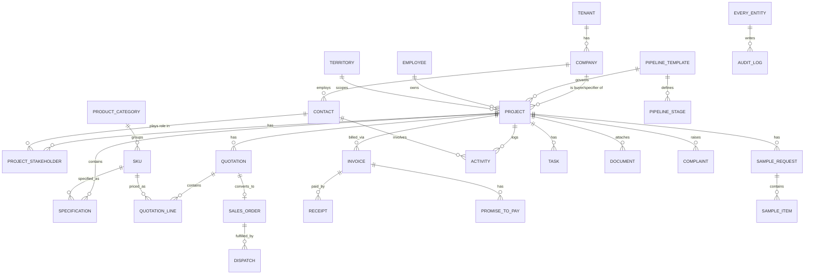

# ⚠ ARCHIVED — Vyara Industry OS Blueprint **V2**

> **This document is SUPERSEDED by `vyara-vision-blueprint-v3.md`.**
> Kept on disk for historical reference only. Do **not** use it as a source of truth for architecture, scope, or capability decisions — many of its assumptions (notably "project as the spine," "integrate-only inventory," and the horizontal-manufacturing-platform framing) have since been explicitly revised. Future sessions and contributors should read v3 + the updated Constitution v2 instead.

---

# Vyara — Industry OS Blueprint **V2 (Vision Blueprint, frozen)**
### Manufacturing Revenue & Project OS — restructured for buildability

*V2 incorporates the review feedback. It deliberately removes the per-deliverable consulting scaffolding (Exec Summary / Alternatives / Trade-offs / Best Practice) and replaces it with buildable artifacts — ERD, state machines, event list, permissions matrix, screen inventory, component library. Where I disagree with the feedback, it's marked **⚔ CHALLENGE**.*

> **Stance on scope.** The review rightly says "stop expanding the prose." It also asks to add seven modules + a UX deliverable. I've resolved the contradiction by changing the *kind* of content, not the volume: this version is leaner in prose and heavier in directly-usable artifacts. After this, the document freezes as V1-of-vision; the next outputs are implementation artifacts (see §10).

---

## 1. Corrected top-level architecture

### 1.1 Value streams (primary spine) — accepted, with one refinement
Organise the product around value streams, with modules underneath.

**⚔ CHALLENGE — added stage.** A spec-led business doesn't start at *Acquire*; it starts at **Influence** (getting specified), which precedes any convertible opportunity by months. The stream is:

```
Influence → Acquire → Convert → Execute → Deliver → Collect → Retain
```

| Stream | What happens | Modules underneath |
|---|---|---|
| **Influence** | Get specified by architects/consultants; samples; design support | Specification, Samples, Design Services, Influence Graph |
| **Acquire** | Capture & qualify demand across channels | Lead/Enquiry, Tender intake, Website/IndiaMART |
| **Convert** | Move project to order | Project pipeline(s), Quotation, Pricing, Approvals |
| **Execute** | Turn order into production/dispatch readiness | Order, Production coordination (read), Dispatch |
| **Deliver** | Fulfil and confirm | Dispatch, Logistics, POD, Documents |
| **Collect** | Get paid | Receivables, Collections, Dunning, AI Voice |
| **Retain** | Repeat & expand | Repeat-business, Dealer mgmt, Complaints/Service |

### 1.2 The Engine Layer + Vertical Configurations (the SaaS architecture) — accepted
The platform is a set of horizontal **engines** consumed by every module, with thin **vertical configurations** on top.

```
                 ┌──────────────── VERTICAL CONFIGS ────────────────┐
                 │  Tiles(v1)  Steel  Cement  Paint  Furniture       │
                 │  Construction  Subsidy  Chemical                  │
                 └───────────────────────────────────────────────────┘
   ┌────────────────────────── ENGINES (shared) ──────────────────────────┐
   │ Core(entities) · Workflow · Document Intelligence · AI Platform       │
   │ Communication · Approval · Reporting · Search · Notification · Forms  │
   └───────────────────────────────────────────────────────────────────────┘
```

**⚔ CHALLENGE — timing.** Build these as **clean modules inside the modular monolith with hard boundaries**, *not* as separately deployed services. Prematurely extracting seven engines into a microservice platform before one vertical is proven repeats the V1 over-engineering risk. The engine *boundaries* are an architectural discipline now; the *physical* extraction is a future event triggered by real multi-tenant scale.

### 1.3 Multi-pipeline on a single Project object — **⚔ CHALLENGE accepted-with-correction**
The review is right that Architect, Dealer, Tender, Retail, Government, and Corporate journeys differ. But they must **not** become five separate pipelines/systems — that fragments the project object and destroys cross-segment reporting and dedup.

**Correct construction:** one `project` entity + a **`pipeline_template` per segment** (different stages, gates, SLAs, required documents), selected by `project.segment`. Same object, configurable journey. The workflow engine already makes this a configuration, not new code.

```
project.segment ─▶ pipeline_template
  architect   ▶ Identify → Specified → Tracking → Paving-stage → Quote → Won
  dealer      ▶ Onboard → Order → Fulfil → Reorder
  tender      ▶ Detected → Eligibility → Bid → Result → (Project)
  retail      ▶ Enquiry → Visit/Quote → Order
  government  ▶ Tender/Empanel → Submit → Process(DIC-like) → Supply → Claim
  corporate   ▶ RFQ → Spec → Negotiate → Award → Execute
```

### 1.4 AI as a Platform (not scattered features) — accepted
```
AI Platform
├── Providers      (Claude Haiku/Sonnet, Sarvam STT/TTS — swap via config)
├── Prompts        (versioned, per task)
├── Skills         (classify, extract, draft, summarise, score, predict)
├── Agents         (collections concierge, field copilot, board reporter)
├── Memory         (project/contact context, RAG knowledge base)
├── Actions        (gated: draft-only vs autonomous, human-in-loop where money/reputation)
├── Knowledge Base (drawings, specs, certs, past quotes — RAG)
└── Evaluation     (accuracy, fallback rates, golden sets)
```
Every module consumes the platform; no module owns its own AI. Non-AI fallback mandatory for each skill.

---

## 2. New first-class modules/engines (the review's catches)

### 2.1 Document Intelligence Engine — *biggest accepted addition*
Not "attachments." A first-class pipeline:
```
Inbox (email/WhatsApp/upload) → Classify (PO/BOQ/Invoice/Tender/Drawing/Cert/Photo)
→ OCR/Extract (Claude Vision) → Human Validation → Version → Approve → Link to project/entity → Archive
```
Powers: BOQ→quote parsing, PO capture, tender-doc assembly, cert management, IPO audit pack. **Priority: Phase 1 for capture/link; Phase 2 for OCR/extraction.**

### 2.2 Task Management — *accepted, Phase 1*
Personal + entity-linked tasks (project/lead/quote/sample/collection/complaint), recurring, escalations. Views: Today, Overdue, Kanban, Calendar. This is the field engineer's home screen and the antidote to "nobody knows what's next."

### 2.3 Notification Center (Engine) — accepted
Central, template-driven, multi-channel (email/WhatsApp/SMS/push/in-app), with digests, reminders, escalations. Driven by domain events (§8).

### 2.4 Unified Audit Timeline — accepted
Every entity shows one chronological timeline: created/assigned/modified/approved/rejected, comments, documents, messages, calls, activities, **AI actions**. Backed by `audit_log` + `activity`. Doubles as IPO-grade traceability.

### 2.5 Communication Hub (Engine) — accepted
Auto-logs email/WhatsApp/calls/SMS/meeting notes/voice notes against project+contact. Field voice-note → structured activity (Sarvam + Claude).

### 2.6 Global Search (Engine) — accepted
Search across projects, contacts, quotes, invoices, dealers, architects, documents — and by phone, GSTIN, PO no., invoice no. Postgres FTS + trigram in MVP; dedicated search later.

### 2.7 Form Builder / Custom Fields (Engine) — **⚔ CHALLENGE on timing**
Accepted as essential for the *SaaS* thesis ("I need 3 extra fields"). But it's meta-tooling: building it before the core ships delays Vyara value. **Phase 2–3.** In MVP, use a pragmatic `custom_field_value` JSON column on key entities; graduate to a full builder (sections, validation, conditional logic, visibility) when onboarding the *second* vertical.

---

## 3. Module map by value stream (with phase)

| Stream | Module | Phase |
|---|---|---|
| Influence | Influence Graph (contacts/firms, roles) | 1 |
| Influence | Specification register + paving triggers | 1 |
| Influence | Sample lifecycle + ROI | 2 |
| Influence | Design Services workflow | 3 |
| Acquire | Lead/Enquiry capture + routing | 1 |
| Acquire | Tender intake | 3 |
| Convert | Project pipeline(s) + templates | 1 |
| Convert | Catalog + Pricing engine | 1 |
| Convert | Quotation | 1 |
| Convert | Approval workflows | 1 |
| Execute | Order management | 2 |
| Execute | Production coordination (read-only) | 2 |
| Deliver | Dispatch & logistics | 2 |
| Deliver | Document management | 1→2 |
| Collect | Receivables + ageing | 2 |
| Collect | Collections (WhatsApp + AI voice) | 2 |
| Retain | Dealer management | 2 |
| Retain | Complaints/Service | 3 |
| Retain | Repeat-business engine | 3 |
| Cross | Task Mgmt · Notifications · Audit Timeline · Comms Hub · Search | 1 |
| Cross | AI Platform | 1 (infra) → skills phased 2–3 |
| Cross | Document Intelligence (OCR/extract) | 2 |
| Cross | Form Builder | 2–3 |
| Cross | RBAC + Workflow engine | 1 |

---

## 4. Domain model / ERD (core revenue spine)



Conventions: `snake_case`; singular tables; FK `<entity>_id`; join tables `<a>_<b>`; history `<entity>_history`; `is_/has_` booleans; `*_at` timestamps. **Every table carries `tenant_id` + audit columns + soft-delete.** Price is **snapshotted** onto `quotation_line`. `project_stakeholder` is the N–N join (role: specifier/buyer/influencer) the V1 review correctly highlighted.

*(Full all-table ERD is implementation artifact #1 — §10.)*

---

## 5. State machines (pipeline & process)

```
QUOTATION:   draft → pending_approval → approved → sent → viewed →
             negotiating → (won | lost | expired)     [reason_code on lost]

SAMPLE:      requested → (approved | rejected) → dispatched → delivered →
             (converted | no_outcome)   [auto-followup if no_outcome > N days]

COLLECTION:  due → pre_due_reminder → overdue → dunning_whatsapp →
             ai_voice_escalation → promise_to_pay → (paid | disputed | written_off)

COMPLAINT:   logged → triaged → assigned → in_progress → (resolved | escalated) → closed

PROJECT (architect template):
             identify → specified → tracking → paving_stage → quoting → won/lost
             (back-flow allowed: any stage → tracking via reason_code, mirrors
              Subsidy "Need Clarification")
```
All stages: mandatory remark before advance; configurable gates (required docs/fields); SLA timer + escalation. Engine = the proven Subsidy state-machine, generalised.

---

## 6. Domain event list (event-driven core, Inngest)

```
lead.captured · lead.assigned · lead.qualified
project.created · project.stage_changed · project.dormant · project.reactivated
specification.recorded · specification.paving_stage_reached
sample.requested · sample.dispatched · sample.no_outcome
quote.created · quote.submitted_for_approval · quote.approved · quote.sent
quote.viewed · quote.won · quote.lost
order.created · dispatch.scheduled · dispatch.completed
invoice.synced · invoice.overdue · payment.promised · payment.received
complaint.logged · complaint.sla_breached · complaint.resolved
tender.deadline_approaching
document.received · document.extracted · document.approved
ai.action_logged · approval.requested · approval.granted · approval.rejected
```
Events fan out to Notification, AI, and Integration consumers — decoupling modules.

---

## 7. Permissions matrix (RBAC core)

| Capability / Data | Field Eng | Inside Sales | Sales Mgr | COO | Accounts | VP/MD | Indep Dir (Auditor) | Dealer |
|---|---|---|---|---|---|---|---|---|
| Own-territory projects | RW | RW (all) | RW (team) | RW (all) | R | R | R | own |
| **Margin / cost / discount %** | — | — | view | view | view | view | view | — |
| Discount approval | — | — | ≤ tier1 | ≤ tier2 | — | unlimited | — | — |
| Pricing config | — | limited | — | — | — | approve | — | — |
| Receivables | — | — | R | R | RW | R | R | own ledger |
| MIS / board reports | — | — | team | all | finance | all | all (R) | — |
| Masters/config | — | — | — | — | — | approve | — | — |
| Audit log | — | — | — | R | R | R | R | — |

Territory scoping recursive via `reporting_to`. Delegation + time-boxed grants. SSO-ready (SAML/OIDC later). **Margin masking from field engineers is non-negotiable** (market norm + Naresh trust).

---

## 8. Deliverable 15 — UX Architecture

### Navigation (role-aware)
- **Desktop primary nav:** Dashboard · Projects · Contacts · Quotes · Samples · Orders/Dispatch · Collections · Documents · Dealers · Reports · Settings.
- **Field mobile nav (bottom bar):** Today (tasks) · Projects · Quick-Add (voice) · Search · Me.
- **Quick actions:** new project, new quote, log visit (voice), request sample, log payment promise.
- **Widgets/dashboards:** role-configured (see Reporting in V1 §11).

### Screen inventory (MVP-relevant)
```
Auth: Login · Forgot · (SSO later)
Dashboard (role variants: MD · COO · Sales Mgr · Engineer · Accounts)
Projects: List · Kanban (by stage) · Project Detail (tabs: Overview · Stakeholders ·
   Specifications · Samples · Quotes · Orders · Documents · Timeline · Tasks)
Contacts/Firms: List · Detail (timeline, projects, role)
Quotes: List · Builder · Detail · Approval queue
Catalog/Pricing: SKU list · Price lists · Discount matrix (admin)
Samples: Request · Tracking board · ROI report
Orders & Dispatch: SO list · Dispatch schedule · POD
Collections: Ageing board · Account detail · Dunning console
Documents: Inbox · Validation queue · Archive · Entity-linked view
Dealers: List · Ledger · Schemes · (portal later)
Tasks: Today · Overdue · Kanban · Calendar
Search: Global results
Reports: per persona
Settings: Masters · Workflow config · Pipeline templates · Roles/permissions ·
   Templates (notification/comms) · Custom fields (Phase 2) · Integrations
Field App: Today · Project quick-view · Log visit (voice) · Quick quote · Request sample
```

### Component library (build once, reuse)
```
Cards (entity, KPI, AI-suggestion, approval) · Data tables (filter/sort/saved-views) ·
Kanban board · Timeline · Comments/mentions · Attachments · Activity feed ·
Approval card · AI card (suggestion + accept/edit/reject) · Notification bell/center ·
Chat/WhatsApp thread · Global search · Filter bar · Stage stepper · Pricing line editor ·
Ageing buckets · Empty/placeholder · Mobile voice-capture sheet
```

---

## 9. Revised risks (delta over V1)

- **Engine over-abstraction** — building 7 platform engines before one vertical ships. *Mitigation: modules-with-boundaries inside the monolith; extract only at real scale.*
- **Multi-pipeline fragmentation** — if built as separate pipelines instead of templates-on-one-object, cross-segment reporting and dedup break. *Mitigation: §1.3.*
- **Form-builder-too-early** — meta-tooling delaying core value. *Mitigation: JSON custom fields in MVP, full builder in Phase 2–3.*
- **Document Intelligence accuracy** — OCR/extraction on messy BOQs/POs is hard. *Mitigation: human-validation step always; never auto-commit extracted financials.*
- **(Carried from V1, still top)** Field adoption · IP ownership · urgent-vs-enterprise tension · Tally fragility · anchor-customer over-fit.

---

## 10. Recommended next step (agreeing with the review)

This document is now **frozen as the Vision Blueprint**. Further prose expansion has negative returns. The next four outputs are implementation artifacts — best generated in **Claude Code** against the actual repo (especially the Subsidy engine), with this blueprint as input:

1. **Complete domain model + ERD** — all ~40 tables, every relationship, indexes, RLS policies. *(§4 is the spine; this completes it.)*
2. **Screen inventory + IA + navigation map** — full, with wireframe-level component specs. *(§8 seeds this.)*
3. **API contracts + service/module boundaries** — endpoints, payloads, events per module.
4. **12-week implementation plan** — sprint-wise deliverables, dependencies, what reuses the Subsidy engine vs net-new.

I've deliberately seeded #1 and #2 here (ERD spine, screen inventory, state machines, events, permissions) so the handoff isn't cold.

---

## 11. Discovery Questions (new, surfaced this round)

**Architecture/reuse:** How configurable is the Subsidy engine's state machine *today* — can it drive a non-subsidy pipeline via config, or is it coded to subsidy stages? (Decides whether §1.3 multi-pipeline is config or rebuild.) Does WorkflowOS already implement any of the cross engines (notifications, tasks, audit timeline) we can reuse rather than rebuild?

**Documents:** What document *types* and volumes flow daily (POs, BOQs, drawings), in what formats (PDF/image/WhatsApp), and how structured? (Sizes the Document Intelligence effort.)

**Pipelines:** Which segments does Vyara actually run today, and do any share a journey closely enough to collapse into one template? (Avoid building five if three suffice.)

**Forms/config:** Do any near-term verticals (steel/cement/paint) have a real buyer, or is the multi-vertical SaaS still hypothetical? (Decides how much engine generality to fund now vs defer — guards against anchor-customer over-fit.)

**AI:** Which AI skill has a committed owner/budget to be the first shipped (collections voice vs field voice-note vs BOQ extraction)? (Sequences the AI platform rollout by real ROI.)
